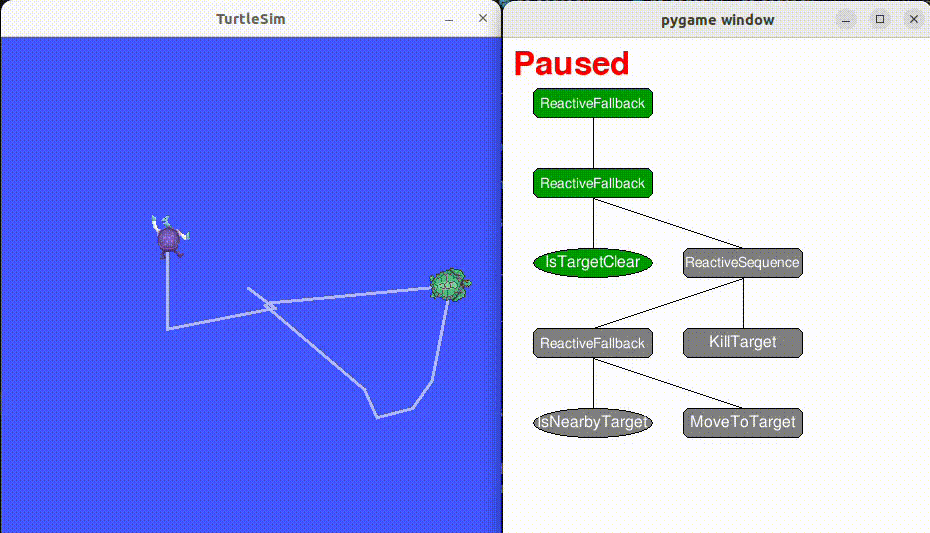

# Scenario: Turtle Catcher

## Overview

A minimal ROS 2 example showing how to use the Behaviour Tree runtime with turtlesim. `turtle1` is controlled by a Behaviour Tree that enables it to autonomously track and catch a target turtle (`turtle_target`). The target turtle can be manually controlled via keyboard input, while `turtle1` uses the Behaviour Tree logic to pursue and follow the target's movements in real-time.

## How to Run

All commands below assume you are in the `autonomy_bt` project root.

**Step 1: Launch Turtlesim**
```bash
ros2 run turtlesim turtlesim_node
```

**Step 2: Spawn a Target Turtle**
```bash
ros2 service call /spawn turtlesim/srv/Spawn "{x: 5.5, y: 5.5, theta: 0.0, name: 'turtle_target'}"
```

**Step 3: Teleoperate the Target Turtle**
```bash
ros2 run turtlesim turtle_teleop_key --ros-args -r /turtle1/cmd_vel:=/turtle_target/cmd_vel
```
Move the spawned turtle using keyboard input. The original turtle (`/turtle1`) will be controlled by the Behaviour Tree.

**Step 4: Run Turtle1 Action Server**
```bash
python3 scenarios/ros2/turtle_catcher/action_servers/turtle_nav_action_server.py --ns /turtle1
```

**Step 5: Run Behaviour Tree Controller**
```bash
python3 main.py --config=scenarios/ros2/turtle_catcher/configs/config_turtlesim.yaml
```

## Configuration

| Config | Description |
|--------|-------------|
| `configs/config_turtlesim.yaml` | ROS 2 platform config with `/turtle1` namespace, BT tick rate 10 Hz |

Key parameters:
- **Platform**: `ros2`
- **Agent namespace**: `/turtle1`
- **BT tick rate**: 10.0 Hz
- **BT visualiser**: Enabled (600x600 window)

## Behaviour Tree

The BT uses ROS 2 topic subscriptions and action clients:

- **IsNearby**: Subscribes to `/turtle1/pose` and `/turtle_target/pose`, checks distance threshold
- **MoveTo**: Sends `NavigateToPose` action goals to the navigation action server
- **KillTarget**: Calls the `/kill` service to remove the target turtle
- **IsTargetClear**: Checks if `/turtle_target/pose` has no publishers (target removed)

## Test Verification

- The turtlesim window shows `turtle1` chasing `turtle_target`.
- Moving the target with keyboard causes `turtle1` to change direction and follow.
- When `turtle1` gets close enough, the target turtle is killed via the `/kill` service.
- The BT visualiser window (if enabled) shows the active BT node states in real time.

## Demo


